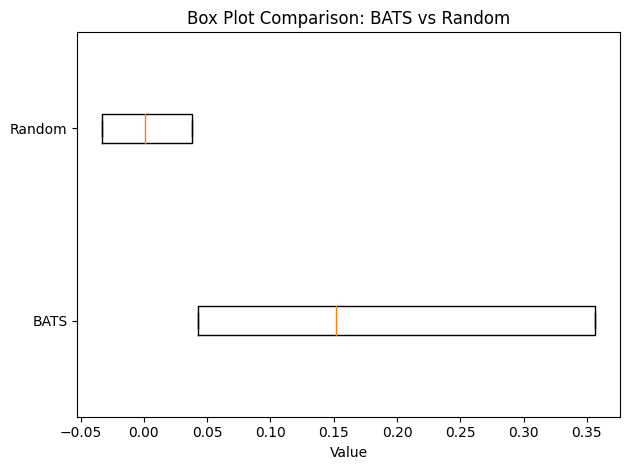
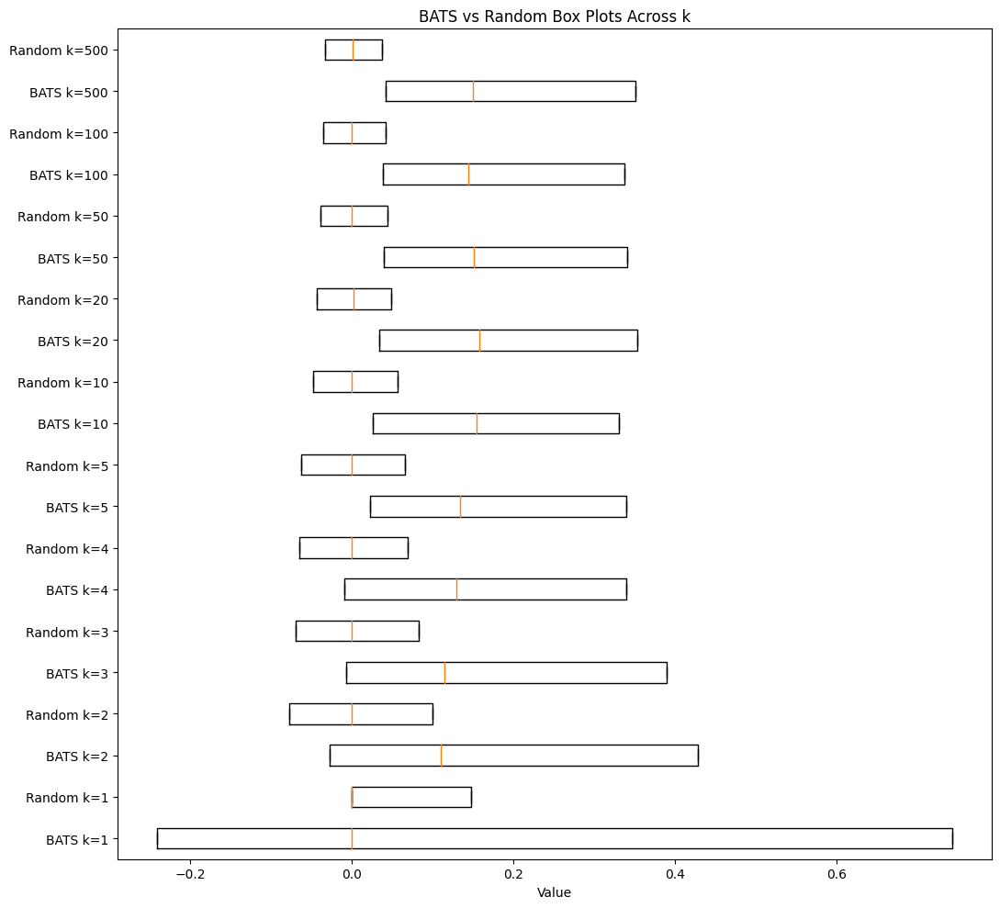

# word3vec

It has been well observed that popular word embeddings (word2vec, GloVe) preserve analogy parallelograms. Indeed, if $v_a, v_b, v_c, v_d \in \mathbb{R}^d$ are some low-dimensional embeddings corresponding to an analogy quadruple $a : b :: c : d$, it has been emperically observed that $v_a - v_b \approx v_c - v_d$

Prior theoretical explanations for this phenomenon (Arora et al., 2016; Gittens, Achlioptas, and Mahoney, 2017; Korchinski et al., 2025) assume some latent probabilistic model for the generation of language which induces a certain structure on the word co-occurence matrix ... which in turn leads to analogy preserving embeddings. On the contrary, we proposes that analogy parallelograms already exist in a ground-truth representation of words-- even before text is generated. We start by defining words in the vocabulary $$\{w_1, ... ,w_m\}$$ in terms of an exhaustive set of concepts $C$ and then define analogies in terms of concept set differences. Our main claim is that the co-occurence probability of words $w_i, w_j$ for some window $\delta$ is (roughly) some monotonically increasing function of the number of words $w$ that share common concepts with $w_i, w_j$. We then argue that the resulting co-occurence matrix leads to embeddings which preserve analogy parallelograms (our project will also include some interesting results on the minimum dimension requiredf for embeddings in order to preserve analogy parallelograms).

Formally, we define a set of words $w_1, ... ,w_m$ and a set of concepts $C$. Each word has a cet of concepts associated with it, which we call $C(w)$; the set $W(c)$ represents the number of words associated with concept $c \in C$. Then we say that $w_i, w_j, w_k, w_l$ form an analogy if:

$$C(w_i)-C(w_j) = C(w_k)-C(w_l)$$ and
$$C(w_j)-C(w_i) = C(w_l)-C(w_k)$$

where the minus sign here represents a set difference. Furthermore, we define word similarity $s(w_i,w_j)= |C(w_i) \cap C(w_j)|$ (note, this is just one way of defining word similarity; we are still working on this and have proposed alternate definitions as well) and claim that the probability of two words co-occuring in a window $\delta$ is given by $P_\delta[wi, w_j] \propto f(s(w_i,w_j))$ where $f$ is some monotonically increasing function. Our claim is that the resulting co-occurence matrix leads to embeddings that preserve analogy parallelograms.

This theory motivates quite a few experimental questions; here are some of the ones we have considered thus far:
 (a) can we really derive analogy preserving embeddings from co-occurence statistics?
 (b) does our concept set definition of words properly explain co-occurence stats?
 (c) are there transformations of the co-occurence matrix that can result in better embeddings?
 

Though the first question has been verified before (Ri, Lee, and Verma, 2023) we verified it again. We considered a text corpus 4 billion words taken from the Dolma dataset and used it to first construct a vocabulary of the top 300,000 most occuring words. We then constructed a 300k by 300k co-occurence matrix with window-size 5 (see cooc_cc100.cpp) and filtered out certain stop words ("the", "a" etc.).

Now for each $w_i$ we consider its corresponding row in the co-occurence matrix (scaled by number of occurences of the row word) and take that as our embedding. Then, for word quadruples $w_a, w_b, w_c, w_d$ we computed the cosine similarity of vectors $w_a - w-b$ and $w_c - w_d$. We did this for analogy quadruples from the BATS 3.0 dataset and for randomly generated quadruples. We found the following summary statistics:

  

indicating that there is some analogy parallelogram structure present in the rows of the co-occurence matrix. 

Experimental question (b) was a bit tough to answer. While we tried (with the help of LLMs) to generate actual concept representations of words and then predict co-occurences using our theory, the results did not support our claim. I believe that this is due to the fact that concepts themselves are not well-defined in practice which made it difficult to simulate our predicted co-occurence statistics.

For experiment (c) we tried a couple different alternate embeddings for words derived from the co-occurence matrix. First, (motivated by Arora et. al, 2016) we tried the PCA embeddings of the co-occurence matrix. This actually led to a weaker separation between the BATS and random quadruple cosine similarity results. The same happened when we instead used the PPMI embeddings derived from co-occurence statistics. 

We then tried an ablation experiment where we took as our embedding the scaled row corresponding to $w_j$ of the co-occurence matrix and kept only the top $k$ counts in that row. Then we tried the same BATS vs Random cosine similarity comparison: 

  

When the embeddings are 1-sparse, the BATS v Random separation is not maintained at all and most vector differences have dot product zero (this makes sense because these one-hot embeddings should rarely co-occur the most with the same word). But results improve quickly as we increase sparsity; the results for a 100-sparse vector nearly match those for embeddings derived from the full co-occurence matrix. These ablation studies provide insight into the size of the "support" for a given analogy quadruple that captures sufficient information about the analogy.

Aside from experiment (a), the other experiments are largely exploratory but have helped us develop a better sense for the more general question "what kinds of co-occurence driven embeddings preserve analogies." Our remaining work on this project will involve further refining the math that connects concept set definitions of words to co-occurence statistics, along with coming up with a dimensionality reduction result for analogy preserving embeddings.
